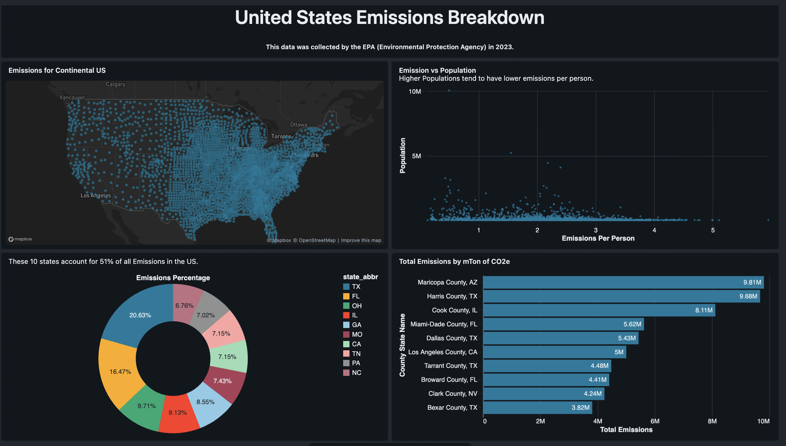

# 2023 U.S. EPA Emissions Analytics Dashboard

## Project Overview

This project analyzes 2023 U.S. EPA emissions data using Databricks SQL and Databricks dashboard visualizations. The goal was to build an end-to-end analytics workflow that imports raw emissions data, cleans and transforms it using SQL, calculates emissions metrics, and presents a geographic emissions breakdown across the United States.

The final dashboard analyzes emissions by location, state, county, population, and emissions per person.

## Dashboard Preview

## Tools Used

* Databricks Free Edition
* Databricks SQL
* SQL Editor
* Databricks Dashboard
* EPA Emissions Dataset

## Dataset

The full emissions CSV file is included in the `data/` folder. The dataset contains county-level emissions, population, employment, energy consumption, utility, transportation, building, and expenditure-related fields.

For this dashboard, the analysis focuses mainly on:

* State and county identifiers
* Latitude and longitude
* Population
* Greenhouse gas emissions measured in metric tons of CO2e
* State-level and county-level emissions aggregations
* Emissions-per-person metrics

A data dictionary is included here:

`data/data_dictionary.md`

## Project Workflow

1. Imported raw EPA emissions data into Databricks.
2. Created SQL queries to explore, clean, and transform the dataset.
3. Converted string-based numeric fields into usable numeric values.
4. Calculated emissions-per-person metrics using emissions and population data.
5. Aggregated emissions at the state and county levels.
6. Built dashboard visualizations in Databricks to communicate key emissions patterns.

## SQL Queries Included

The project includes the following SQL queries:

* `emissions_location_map`
  Prepares latitude, longitude, and emissions fields for the geographic point map.

* `emissions_per_person_by_county`
  Calculates emissions per person and compares emissions intensity with county population.

* `total_emissions_by_state`
  Aggregates total greenhouse gas emissions by U.S. state.

* `top_10_states_emissions_share`
  Calculates each top state’s share of total U.S. emissions.

* `top_counties_by_emissions`
  Ranks counties by total greenhouse gas emissions measured in metric tons of CO2e.

The SQL queries are available in:

`sql/emissions_analysis_queries.sql`

## Dashboard Visualizations

### 1. Emissions Location Map

A point map showing emissions locations across the continental United States using latitude and longitude fields.

### 2. Emissions vs. Population Scatter Plot

A scatter plot comparing county population with emissions per person to identify regional outliers and understand how emissions intensity varies across counties.

### 3. Top 10 States Emissions Share

A donut chart showing the share of total U.S. emissions contributed by the top 10 states.

### 4. Top Counties by Total Emissions

A bar chart ranking the counties with the highest total greenhouse gas emissions.

## Key Insights

* The top 10 states account for approximately 51% of total U.S. emissions.
* High-emission counties are concentrated in large metropolitan or industrial regions.
* Population alone does not fully explain emissions levels.
* Some counties show high emissions per person despite having smaller populations.
* Geographic visualizations help identify emissions concentration patterns more clearly than table-only analysis.

## Skills Demonstrated

* SQL data cleaning
* Data type conversion
* Aggregation and grouping
* Emissions-per-person metric calculation
* State-level and county-level analysis
* Geographic data visualization
* Dashboard design
* Data storytelling
* Databricks SQL workflow

## What I Learned

This project helped me practice building a complete analytics workflow from raw data ingestion to dashboard creation. I strengthened my understanding of SQL transformations, data cleaning, metric creation, Databricks tables, geographic analysis, and visual storytelling for analytics.

I also learned how to organize a data project for GitHub by including SQL queries, dashboard screenshots, dataset documentation, and a clear project summary.
